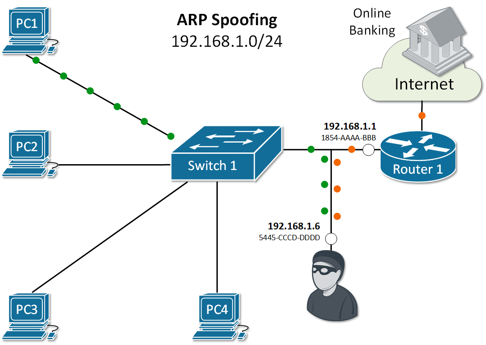

# Cobra Network Attacker

Cobra Network Attacker is a powerful and versatile network penetration testing tool designed for educational purposes. It provides a range of features that help network security enthusiasts and professionals learn about various types of attacks and how they work. The tool includes three main attack methods: **MITM (Man-In-The-Middle)**, **DoS (Denial of Service)**, and **Brute Forcing**. Each attack method has specialized sub-options for more in-depth testing, such as **SSL Stripping** and **DNS Spoofing**.

## Purpose

I created Cobra Network Attacker as a learning project to gain a deeper understanding of networking concepts and the different types of attacks that can compromise network security. By simulating these attacks, I aim to improve my knowledge of network protocols and gain practical experience in real-world network security testing.

## Features

1. **MITM (Man-In-The-Middle)** - Intercept and modify the communication between two devices on the network. Includes options for:
   - **ARP Spoofing**: Manipulate ARP (Address Resolution Protocol) tables to redirect traffic through the attacker machine.
   - **SSL Stripping**: Downgrade secure HTTPS connections to HTTP, allowing the attacker to read encrypted traffic.
   - **DNS Spoofing**: Redirect network traffic by providing false DNS responses to the target.

2. **DoS (Denial of Service)** - Overwhelm a target device or network with traffic to make it unavailable.

3. **Brute Forcing** - Attempt to crack passwords using brute force methods.

## ARP Spoofing

ARP (Address Resolution Protocol) is used to map IP addresses to MAC addresses in local area networks (LANs). It is a crucial part of the network communication process. ARP Spoofing (also known as ARP Poisoning) is an attack where the attacker sends fake ARP messages over the network, associating their own MAC address with the IP address of another device (e.g., the gateway). This allows the attacker to intercept, modify, or block communication between devices on the network.

By using **ARP Spoofing** in Cobra Network Attacker, you can simulate this attack and observe how it can be used for MITM attacks.


## SSL Stripping

SSL Stripping is an attack that downgrades a secure HTTPS connection to an unencrypted HTTP connection. The attacker sits in the middle of the communication between the client and the server and intercepts the initial HTTPS request. The attacker then forwards the request to the server as HTTP, while maintaining an HTTPS connection with the client. This allows the attacker to read sensitive data that would otherwise be encrypted.

This method of attack is included in the **MITM** section of Cobra Network Attacker to demonstrate how attackers can bypass SSL encryption and steal sensitive information.

## DNS Spoofing

DNS Spoofing (also known as DNS Cache Poisoning) is an attack where the attacker provides fake DNS responses to the victim. Instead of resolving the correct IP address for a given domain, the attacker sends a false IP address, redirecting the victim to a malicious website. This can be used for various attacks, including phishing or intercepting login credentials.

Cobra Network Attacker allows you to simulate this attack by sending falsified DNS responses and redirecting network traffic to a fake server.

## Usage

1. Clone the repository:
    ```bash
    git clone https://github.com/ido2718/cobra_Network-Attacker.git
    ```

2. Install dependencies:
    ```bash
    pip install -r requirements.txt
    ```

3. Run the tool:
    ```bash
    python attacker.py
    ```

4. Select the desired attack method (MITM, DoS, Brute Force), and if choosing MITM, you can select between ARP Spoofing, SSL Stripping, or DNS Spoofing.

## Legal Disclaimer

Cobra Network Attacker is a **penetration testing tool** designed for **educational purposes** and **network security research**. It is critical to understand the **legal responsibilities** and **ethical implications** when using this tool.

### **Important Legal Considerations:**
1. **Authorization**: 
   - **Always obtain explicit written consent** from the owner of the network or systems you are testing. Unauthorized use of this tool to attack or interfere with other people's networks is **illegal** and could result in criminal prosecution.
   - Only use Cobra Network Attacker in environments where you have the **legal right to perform network testing**, such as on your own devices or in a **test lab environment** where you have permission.

2. **Penetration Testing**: 
   - If you are using this tool as part of penetration testing, ensure that you have formal authorization (e.g., a signed contract) to perform these tests. Conducting penetration testing without permission is **illegal** and can cause unintended damage.

3. **Ethical Use**:
   - Use Cobra Network Attacker ethically and responsibly. The goal is to learn about network security and how attacks work, but not to exploit vulnerabilities or cause harm to others.

### **Risks and Responsibility**:
   - You are **solely responsible** for any actions you take using this tool. Always ensure that you comply with local laws and regulations regarding cybersecurity.
   - The creator of Cobra Network Attacker **does not support or endorse malicious activities**. This tool should be used only for **ethical hacking** in controlled environments and for educational purposes.

By using this tool, you agree to use it in compliance with all applicable laws and regulations.

## Contributing

Feel free to fork the repository and contribute. If you find any bugs or would like to suggest new features, please submit a pull request.

.
